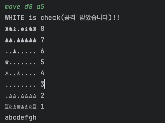
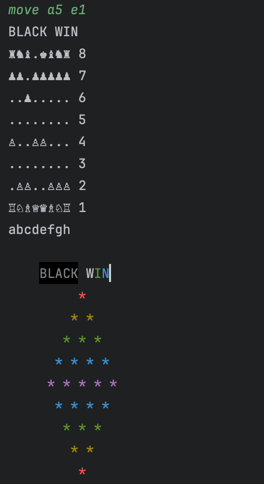

# be-chess

2024 우아한 테크캠프 7기 체스 프로젝트

## 주의할 점

- Lucas 컨텐츠의 내용을 공개된 저장소 또는 웹에 올리는 것은 엄격하게 금지합니다.
- 커밋메시지는 한글로 두 줄 이상 작성합니다.
- MVC 패턴은 가급적 지양합니다.

# 사용 software
- java 17.0.11

# 사용법
- java/chess/Main.class 실생
- 게임 시작
  - 터미널에 start 입력
- 말 이동
  - 터미널에 move 현재위치 이동할위치
    - ex) move a2 a4
    - 체스판 아래의 white 부터 이동
- 왕을 잡을 수 있는 상황이면 check 를 알려줍니다
- 왕을 잡으면 게임이 끝납니다.
- 잘못된 입력은 안내문과 함께 재입력을 받습니다.

