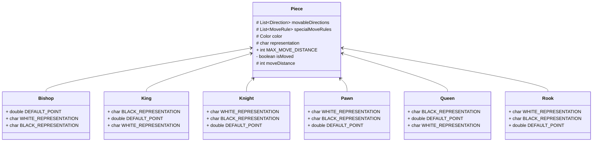

# Chess
2024 우아한 테크캠프 7기 체스 프로젝트

## 실행방법
`src/main/java/chess/Main.java` 실행

## 게임

### 명령
- `start` : 게임 시작
```shell
> start
	a	b	c	d	e	f	g	h
8	♜	♞	♝	♛	♚	♝	♞	♜	8
7	♟	♟	♟	♟	♟	♟	♟	♟	7
6	.	.	.	.	.	.	.	.	6
5	.	.	.	.	.	.	.	.	5
4	.	.	.	.	.	.	.	.	4
3	.	.	.	.	.	.	.	.	3
2	♙	♙	♙	♙	♙	♙	♙	♙	2
1	♖	♘	♗	♕	♔	♗	♘	♖	1
	a	b	c	d	e	f	g	h
```
- `end` : 게임 종료
```shell
> end
게임을 종료합니다.
```
- `move [출발위치]` : 기물 이동 가능한 위치 출력
```shell
	a	b	c	d	e	f	g	h
8	♜	♞	♝	♛	♚	♝	♞	♜	8
7	♟	♟	♟	♟	♟	♟	♟	♟	7
6	.	.	.	.	.	.	.	.	6
5	.	.	.	.	.	.	.	.	5
4	.	.	.	.	.	.	.	.	4
3	.	.	.	.	.	.	.	.	3
2	♙	♙	♙	♙	♙	♙	♙	♙	2
1	♖	♘	♗	♕	♔	♗	♘	♖	1
	a	b	c	d	e	f	g	h
> move g1
{ChessPoint[file=h, rank=3]=Common, ChessPoint[file=f, rank=3]=Common}
```
- `move [출발위치] [목적위치]` : 기물 이동
```shell
	a	b	c	d	e	f	g	h
8	♜	♞	♝	♛	♚	♝	♞	♜	8
7	♟	♟	♟	♟	♟	♟	♟	♟	7
6	.	.	.	.	.	.	.	.	6
5	.	.	.	.	.	.	.	.	5
4	.	.	.	.	.	.	.	.	4
3	.	.	.	.	.	.	.	.	3
2	♙	♙	♙	♙	♙	♙	♙	♙	2
1	♖	♘	♗	♕	♔	♗	♘	♖	1
	a	b	c	d	e	f	g	h
> move g1 f3
	a	b	c	d	e	f	g	h
8	♜	♞	♝	♛	♚	♝	♞	♜	8
7	♟	♟	♟	♟	♟	♟	♟	♟	7
6	.	.	.	.	.	.	.	.	6
5	.	.	.	.	.	.	.	.	5
4	.	.	.	.	.	.	.	.	4
3	.	.	.	.	.	♘	.	.	3
2	♙	♙	♙	♙	♙	♙	♙	♙	2
1	♖	♘	♗	♕	♔	♗	.	♖	1
	a	b	c	d	e	f	g	h
```

### 규칙
- 체크
```shell
	a	b	c	d	e	f	g	h
8	.	.	.	.	♚	.	.	.	8
7	.	.	.	.	.	.	.	.	7
6	.	.	.	♙	.	.	.	.	6
5	.	.	.	.	.	.	.	.	5
4	.	.	.	.	.	.	.	.	4
3	.	.	.	.	.	.	.	.	3
2	.	.	.	.	.	.	.	.	2
1	.	.	.	.	♔	.	.	.	1
	a	b	c	d	e	f	g	h
> move d6 d7
체크!
	a	b	c	d	e	f	g	h
8	.	.	.	.	♚	.	.	.	8
7	.	.	.	♙	.	.	.	.	7
6	.	.	.	.	.	.	.	.	6
5	.	.	.	.	.	.	.	.	5
4	.	.	.	.	.	.	.	.	4
3	.	.	.	.	.	.	.	.	3
2	.	.	.	.	.	.	.	.	2
1	.	.	.	.	♔	.	.	.	1
	a	b	c	d	e	f	g	h
```
- castling
  - [x] 캐슬링의 대상이 되는 킹과 룩은 캐슬링하는 시점 전에 움직인 적이 없어야 한다.
  - [x] 킹이 체크인 상태에서는 캐슬링을 할 수 없다.
  - [x] 킹이 캐슬링을 하기 위해 지나가는 칸들 중 상대 기물에 의해서 공격받는 칸이 있어서는 안된다.
```shell
	a	b	c	d	e	f	g	h
8	♜	♞	♝	♛	♚	♝	♞	♜	8
7	♟	♟	♟	♟	♟	♟	♟	♟	7
6	.	.	.	.	.	.	.	.	6
5	.	.	.	.	.	.	.	.	5
4	.	.	.	.	.	.	.	.	4
3	.	.	.	.	.	.	.	.	3
2	♙	♙	♙	♙	♙	♙	♙	♙	2
1	♖	♘	♗	♕	♔	.	.	♖	1
	a	b	c	d	e	f	g	h
> move e1
{ChessPoint[file=g, rank=1]=Castling, ChessPoint[file=f, rank=1]=Common}
> move e1 g1
	a	b	c	d	e	f	g	h
8	♜	♞	♝	♛	♚	♝	♞	♜	8
7	♟	♟	♟	♟	♟	♟	♟	♟	7
6	.	.	.	.	.	.	.	.	6
5	.	.	.	.	.	.	.	.	5
4	.	.	.	.	.	.	.	.	4
3	.	.	.	.	.	.	.	.	3
2	♙	♙	♙	♙	♙	♙	♙	♙	2
1	♖	♘	♗	♕	.	♖	♔	.	1
	a	b	c	d	e	f	g	h
```
- promotion
  - [x] 폰이 마지막 랭크에 도착할 경우 프로모션
  - [x] 프로모션할 말 선택
  - [ ] 프로모션 직후 공격받을 수 없음
```shell
	a	b	c	d	e	f	g	h
8	.	.	.	.	♚	.	.	.	8
7	.	.	.	♙	.	.	.	.	7
6	.	.	.	.	.	.	.	.	6
5	.	.	.	.	.	.	.	.	5
4	.	.	.	.	.	.	.	.	4
3	.	.	.	.	.	.	.	.	3
2	.	.	.	.	.	.	.	.	2
1	.	.	.	.	♔	.	.	.	1
	a	b	c	d	e	f	g	h
> move d7
{ChessPoint[file=d, rank=8]=Promotion, ChessPoint[file=e, rank=8]=Promotion}
> move d7 d8
프로모션할 말을 선택하세요.
1. Queen
2. Rook
3. Bishop
4. Knight
> 1
체크!
	a	b	c	d	e	f	g	h
8	.	.	.	♕	♚	.	.	.	8
7	.	.	.	.	.	.	.	.	7
6	.	.	.	.	.	.	.	.	6
5	.	.	.	.	.	.	.	.	5
4	.	.	.	.	.	.	.	.	4
3	.	.	.	.	.	.	.	.	3
2	.	.	.	.	.	.	.	.	2
1	.	.	.	.	♔	.	.	.	1
	a	b	c	d	e	f	g	h
```

- [ ] enpassant

## 구현

### 체스판
- 8x8 체스판 구현
- `ChessPoint.class` 를 키로 하는 `Map`으로 구현
- chess/Board.java
```java
private final Map<ChessPoint, Piece> boardMap = new HashMap<>();
```
- 좌표를 표햔하기 위해 `ChessPoint.class` 구현
- record class로 구현
- chess/ChessPoint.java
```java
public record ChessPoint(char file, int rank) {
    public ChessPoint {
        if (!isValidFile(file) || !isValidRank(rank)) {
            throw new IllegalArgumentException("유효하지 않은 체스 좌표입니다.");
        }
    }
}
```
- 유효하지 않는 체스 좌표는 생성되지 않는다

### 기물
- 기물을 일반화 시킨 `Piece.class` 구현

- 각 기물들은 각각의 특성들을 가지고 있다
  - 이동 방향과 이동 거리 : 행마법에 따른 움직임
  - 특수한 이동 규칙 : 폰의 이동, 캐슬링 등

### 이동규칙
- 모든 기물의 이동은 **규칙**에 따라 **이동**한다
- `MoveRule` enum class로 이동규칙을 정의하고 각 enum class에 이동방식과 이동을 구현했다.
- chess/move/MoveRule.java
```java
public enum MoveRule{
    Common {
        public void move(Board board, String source, String target) {}
        public Map<ChessPoint, MoveRule> getMovablePoints(Board board, ChessPoint source, Piece piece) {}
    },
    Castling {
        public void move(Board board, String source, String target) {}
        public Map<ChessPoint, MoveRule> getMovablePoints(Board board, ChessPoint kingPoint, Piece piece) {}

        @Override
        public boolean isAttackable() {return false;}

    },
    PawnMove {
        public void move(Board board, String source, String target) {}
        public Map<ChessPoint, MoveRule> getMovablePoints(Board board, ChessPoint source, Piece piece) {}
    },
    Promotion {
        public void move(Board board, String source, String target) {}
        public Map<ChessPoint, MoveRule> getMovablePoints(Board board, ChessPoint source, Piece piece) {}
    },
    None {
        public void move(Board board, String source, String target) {}
        public Map<ChessPoint, MoveRule> getMovablePoints(Board board, ChessPoint source, Piece piece) {}
    };

    public void adapt(Map<ChessPoint, MoveRule> map, Board board, ChessPoint source, Piece piece, boolean onlyAttackable) {
        if (onlyAttackable) {
            if (this.isAttackable()) {
                map.putAll(this.getMovablePoints(board, source, piece));
            }
        }
        else {
            map.putAll(this.getMovablePoints(board, source, piece));
        }
    }

    public abstract void move(Board board, String source, String target);

    public abstract Map<ChessPoint, MoveRule> getMovablePoints(Board board, ChessPoint source, Piece piece);

    public boolean isAttackable() {
        return true;
    }
}
```
- 따라서, 각 기물에 적용되는 규칙만 알고 있으면 된다.

### 이동
- 'Board' 클래스의 `move` 메소드를 통해 기물을 이동시킨다.
- 출발 위치의 기물이 목적위치까지 이동할 수 있는 규칙을 찾아 이동시킨다.
- chess/Board.java
```java
public void move(String source, String target) {
    Piece piece = findPiece(source);
    MoveRule moveRule = piece.getMoveRule(this, ChessPoint.of(source), ChessPoint.of(target));
    moveRule.move(this, source, target);
}
```
- 이동 가능한 위치인지 파악하기 위해서는 `MoveRule`을 적용한다
- chess/piece/Piece.java
```java
public Map<ChessPoint, MoveRule> getMovablePoints(ChessPoint source, Board board, boolean onlyAttackable) {
    // 기본 이동 규칙(행마법)
    Map<ChessPoint, MoveRule> moveablePoints = MoveRule.Common.getMovablePoints(board, source, this);
    // 특수 이동 규칙
    specialMoveRules.forEach(moveRule -> moveRule.adapt(moveablePoints, board, source, this, onlyAttackable));
    return moveablePoints;
}
```