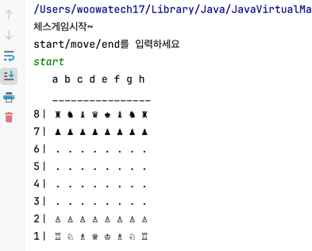

# be-chess

2024 우아한 테크캠프 7기 체스 프로젝트

## 주의할 점

- Lucas 컨텐츠의 내용을 공개된 저장소 또는 웹에 올리는 것은 엄격하게 금지합니다.
- 커밋메시지는 한글로 두 줄 이상 작성합니다.
- MVC 패턴은 가급적 지양합니다.

---

 

## 진행방법
- Command를 터미널에 입력하여 게임을 진행합니다.
  - start: 새로운 게임을 시작합니다.
  - move A B: A위치에서 B위치로 말을 이동합니다. (위치는 A2, B7 같은 형태)
  - end: 게임을 종료하고 점수를 계산합니다.
- 만약 King이 죽을 경우 즉시 게임이 종료됩니다.

 

## 구조
- ChessHost
  - 사용자와 상호작용하며 명령을 수행
- Game
  - 실제 게임을 진행
- Piece (Abstract)
  - 각 기물들을 구조화한 객체

